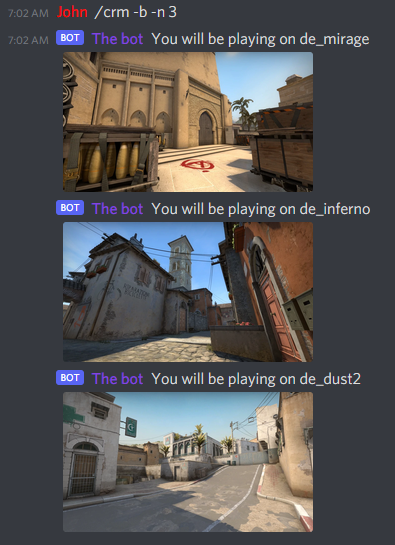

# Overview
This project is about creating a discord bot for fun *Counter Strike: Global Offensive*.

### CSGO Random Weapon
Generates a random combination of weapon and pistol for the game Counter Strike: Global Offensive.
It's kind of a spin wheel to determine what weapons the player should use during the next match for a challenge/fun purpose.

Some weapons are only available on a side (ct or t) then we decided to regroup them as the game did.

### CSGO Random Map
Get a random CSGO map to know what map you will be playing for the next game.

# Install the project 
Install Python 3 and pip3. Then run the script to install the required libraries :
 `sh install-libs.sh`

Create .env file in the ./src directory with your Discord bot token:
 `CRWD_BOT_TOKEN=XXXX`

# Start the bot
Create a bot on Discord and invite it on your server with the appropriate permissions.
The bot need to have the permissions to read and write on the channel.
It also works on private message directly with the bot.

Then simply run the main.js file on your server.

# Bot usage

### CSGO Random Weapon
To get a random combination of weapon and pistol, use the `/crw [-u] [-p] [PLAYER]` command. 

The `-h` option displays the information and available options for the command.

The `-p` option allows you to specify from 1 to 5 players name.
 If not specified, the default will be the nickname or the name of the player using the command. 
 Exemple : `/crw -p Alex John`

For each player to get a unique primary weapon, you have to use the `-u` option.
 By default, the players can get the same primary weapon. 
 Exemple : `/crw -u -p Alex John`

### CSGO Random Map
To get a random map, use the `/crm [-b] [-n] [NUMBER]` command.

The `-h` option displays the information and available options for the command.

The `-n` option allows you to generate n map(s). The number must be an integer greater than 0.
  It won't send twice the same map. By default, the command will generate a single map.
 Exemple : `/crm -n 3`

The `-b` option filters the maps to get only bomb site objective maps.
 Exemple : `/crm -b -n 3`

