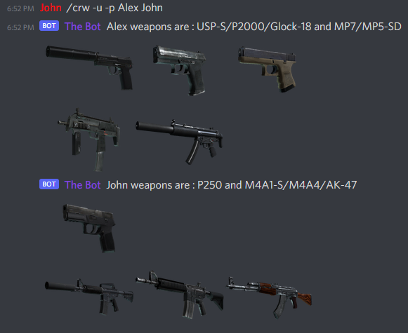

# Overview
This project is about creating a discord bot for fun *Counter Strike: Global Offensive*.

### CSGO Random Weapon
Generates a random combination of weapon and pistol for the game Counter Strike: Global Offensive.
It's kind of a spin wheel to determine what weapons the player should use during the next match for a challenge/fun purpose.

Some weapons are only available on a side (ct or t) then we decided to regroup them as the game did.

# Install the project 
Install Python 3 and the next libraries :
 `pip3 install discord`
 `pip3 install python-dotenv`
 `pip3 install Pillow`

Create .env file in the ./src directory with your Discord bot token:
 `CRWD_BOT_TOKEN=XXXX`

# Start the bot
Create a bot on Discord and invite it on your server with the appropriate permissions.

Then simply run the main.js file on your server.

# Bot usage
To get a random combination of weapon and pistol use the command `/crw`, the bot need to have the permissions to read and write on the channel.
It also works on private message directly with the bot.

The `-h` option displays the information and available options for the command.

The `-p` option allows you to specify from 1 to 5 players name.
 If not specified, the default will be the nickname or the name of the player using the command. 
 Exemple : `/crw -p Alex John`

For each player to get a unique primary weapon, you have to use the `-u` option.
 By default, the players can get the same primary weapon. 
 Exemple : `/crw -u -p Alex John`

